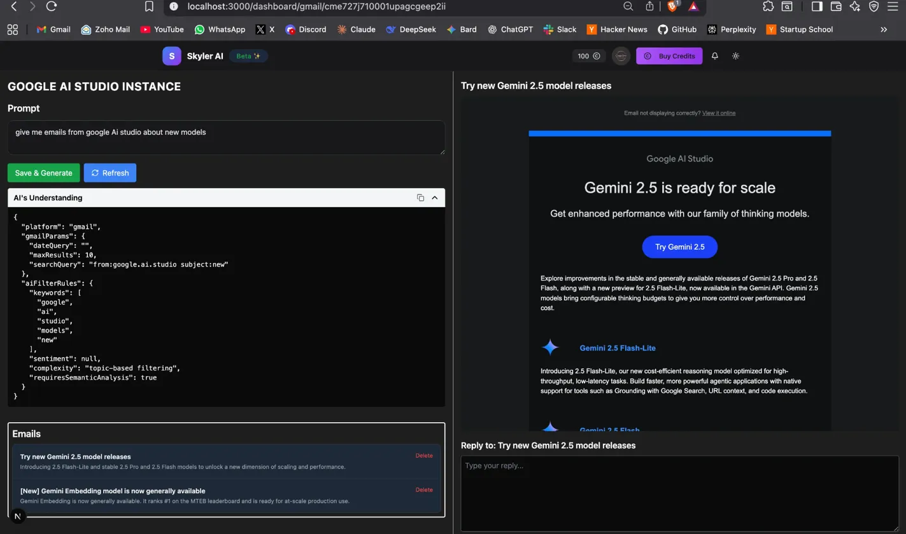

# Skyer AI Blogs

## Description

This is my first SaaS product, It's a Social media organiser, here Just want to keep saving and documenting my over here. Started this product on July 30th. 
---
## 27 Aug 2025

- This is going to be the first release version of product for beta users. 

---
## 23 Aug 2025

- Made changes from prompt base to manual one for improving accuracy.
- Regular Version Hallucinates a lot on converting to user prompt to json
- Solution made to get form, and use AI filter for semantics, and emotion alone

### Previous one

### Current version

--
## 20 Aug 2025

https://github.com/user-attachments/assets/1d67e8e9-0e3b-493c-ba62-7d5224a80b98

---
